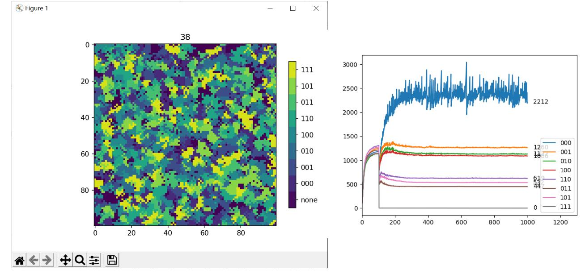
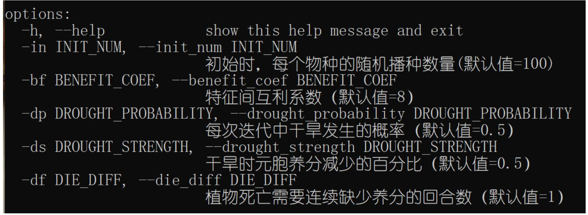
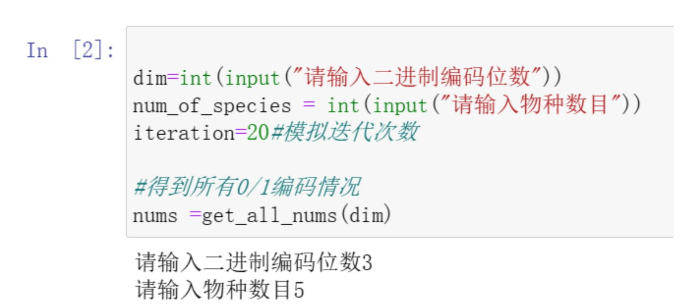
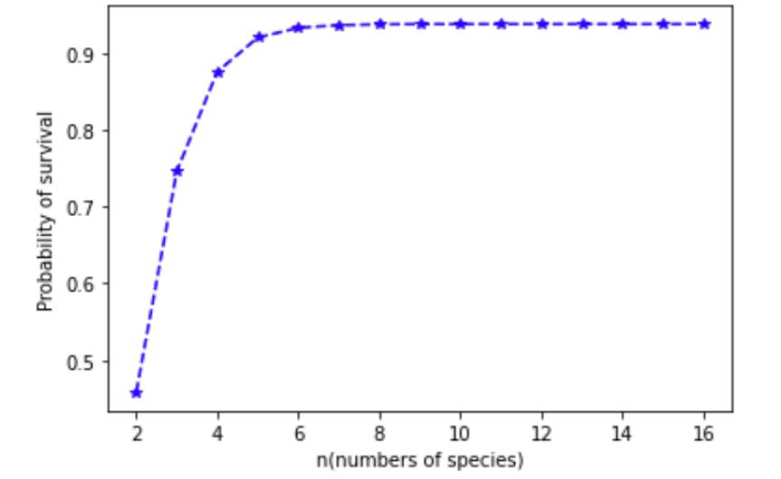

# 基于元胞自动机的植物群落演替模拟

## 1.项目基本说明

本项目主要基于元胞自动机模型进行数学建模，使用python进行模型实现与运行结果可视化。 项目中各文件介绍如下：

1.  simulation.py ——本项目元胞自动机模型的实现代码，可通过命令行设置参数运行，并可以实时 展现模拟结果。 
2.  BlackBox.ipynb——本项目所提出黑箱模型的实现代码，通过jupyter notebook运行。 
3.  pollution.py——对simulation.py中的模型进行部分扩充，引入了污染环境因子。
4.  habitat.py——对simulation.py中的模型进行了部分扩充，引入了栖息地减少的环境因子。

## 2.环境配置

本作品需要在python环境下运行，同时需要安装matplotlib与numpy库，在命令行中输入以下命令实现 依赖库安装：

```
pip install matplotlib==3.5.2 numpy==1.21.6
```

BlackBox.ipynb需要在jupyter notebook中运行，在命令行中使用以下命令安装：

```
pip install jupyter
```

## 3.使用说明

### 一、simulation.py

首先需要在命令行中使用cd命令将当前工作目录切换至作品电子版文件中的Code目录。

```
cd 在您电脑中的目录/Code
```

之后输入以下命令，执行在默认参数下的模型模拟，并实时查看模拟可视化结果，同时可视化结果保存 在outputs文件夹中。 在1000次迭代结束后，目录中会生成名为“0line.png”的图片，为整个模拟过程中不同物种的数量变化曲 线。

```
python simulation.py
```



可输入以下命令查看模型可调参数：

```
python simulation.py -h
```



```
python simulation.py -in 20 -dp 0.8
```

以上的命令设置了初始时每个物种随机播种数量为20，且每次迭代中干旱发生的概率为0.8。

### 二、BlackBox.ipynb

在jupyter notebook中打开该文件后，首先需要运行最上方两个代码块。

#### 1.对特定二进制编码位数和特定物种数目进行模拟



需要用户输入二进制编码位数（物种的特征空间数），与群落的初始物种数目。之后运行下方的代码块 得到模拟结果.

#### 2.对特定二进制编码位数下所有情况进行模拟

输入编码位数后，程序会对该编码位数条件下，所有初始物种组成进行模拟，并输出结果：



### 三、pollution.py和habitat.py

直接在命令行中运行即可

```
python pollution.py
python habitat.py
```

可视化结果分别保存在pollution_outputs与habitat_outputs文件夹中（每100次迭代保存一次），同时 也可得到模拟过程中物种数量变化曲线。